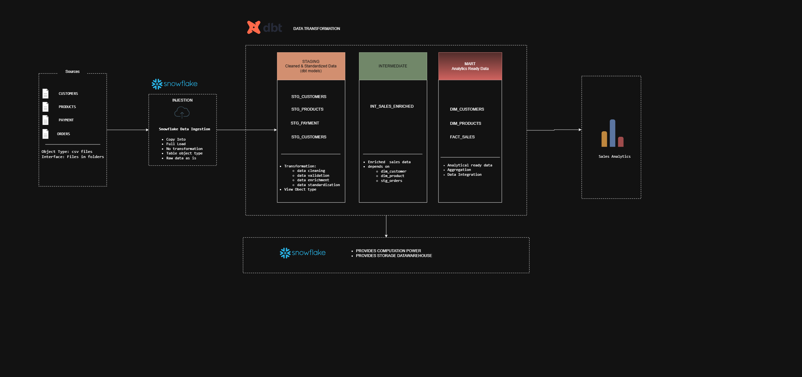
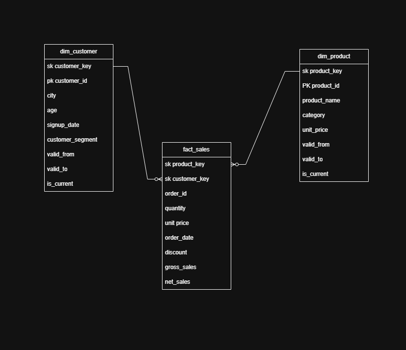

# Sales Analytics | Snowflake + dbt

This project implements an analytics-ready e-commerce data warehouse using **Snowflake and dbt**, with a focus on dimensional modeling, historical data management, and maintainable transformation pipelines.

The warehouse transforms raw customer, product, order, and order-item data into structured analytical models using a layered dbt architecture.

## Architecture


### Staging Layer

The staging layer provides a clean interface between the raw source data and downstream transformations.

Source fields are standardized, cleaned, and prepared here so that business logic remains separate from source-specific transformations.

### Dimensional Modeling

The final analytical layer follows a **star schema**, separating descriptive business entities into dimensions and transactional data into fact tables.

The fact table is modeled at the **order-item grain — one row per product sold within an order**. This allows analysis at both product and order level while maintaining a clearly defined grain.

Surrogate keys are used for dimensional relationships instead of relying solely on source-system identifiers.



### SCD Type 2

Customer and product attributes can change over time, so these dimensions are modeled using **Slowly Changing Dimension Type 2 (SCD2)**.

Rather than overwriting existing records, attribute changes create a new dimension version while preserving the previous state.

Historical records are managed using:

- `valid_from`
- `valid_to`
- `is_current`
- surrogate keys

This allows fact records to reference the correct version of a dimension based on when the transaction occurred.

### Incremental Processing

SCD2 dimensions are implemented using **dbt incremental models** so that existing warehouse data does not need to be rebuilt on every run.

Only new or changed records are processed, while previous versions are expired and retained for historical analysis.

### Data Quality

dbt tests are used to validate key assumptions within the warehouse, including:

- uniqueness of identifiers
- required fields are not null
- referential integrity between models
- consistency of dimensional relationships

## Tech Stack

**Snowflake | dbt | SQL | Jinja | Git**

## Repository Structure

```text
models/
├── staging/          # Source cleaning and standardization
├── intermediate/     # Transformation and business logic
└── marts/
    ├── dimensions/   # Analytical dimensions and SCD2 models
    └── facts/        # Transaction-level fact models

macros/               # Reusable dbt/Jinja logic
tests/                # Data quality checks
```

## Key Engineering Concepts

This project demonstrates practical implementation of:

**Snowflake data warehousing • dbt transformations • dimensional modeling • star schema design • fact table grain definition • SCD Type 2 • incremental models • surrogate keys • historical data tracking • data quality testing • modular SQL transformations**

The result is a warehouse designed to preserve historical context while providing clean, reliable datasets for downstream analytics.
